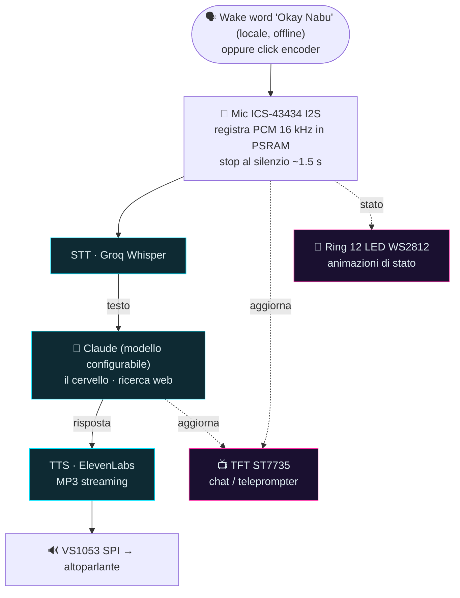

# Alexo — panoramica tecnica

Riferimento tecnico sintetico del firmware **Alexo** (assistente vocale su ESP32-S3).
Per la guida completa e spiegata passo-passo vedi [`MANUALE.md`](MANUALE.md); per la
wake word [`WAKEWORD.md`](WAKEWORD.md). Progetto in **italiano** (codice, commenti,
messaggi seriali).

## Architettura (satellite + cloud)

La catena vocale è ibrida: il riconoscimento della parola di attivazione è **locale**
(offline), il resto sono chiamate **HTTPS** a servizi cloud.



> Riquadri **ciano** = servizi cloud (HTTPS); **magenta** = uscite UI (aggiornate lungo
> tutta la catena). Le frecce tratteggiate = "riflette lo stato", non passaggio di dati.

- **Cervello**: API Anthropic, modello `claude-haiku-4-5` (economico/veloce; si può
  passare a `claude-opus-4-8` per risposte più capaci — runtime dal pannello web).
- **STT**: **Groq** Whisper (gratis). **TTS**: **ElevenLabs** (supporta voce clonata).
  Servono 3 API key (Groq + Anthropic + ElevenLabs); OpenAI è opzionale.
- **Attivazione**: **wake word locale "Okay Nabu"** (microWakeWord/TFLite Micro, tutto
  offline sull'S3) **oppure** click dell'**encoder** — in parallelo. La registrazione si
  chiude da sola dopo **1.5 s di silenzio** (tetto 20 s).
- **Gesti encoder**: **click** = avvia/ferma chat; **doppio click** = on/off del ring
  reattivo al suono; **premuto+giro** = volume; **giro** = scroll. **In MUSICA**
  (ST_MUSIC) il ramo cambia: **click** = stazione successiva, **doppio click** = esci,
  **giro** = volume. (Il click singolo è "differito" ~350 ms per distinguerlo dal doppio:
  la libreria Versatile_RotaryEncoder chiama `handlePress` anche sul 1° click di un doppio
  → disambiguazione in `encoder.cpp`.) GPIO14 (vecchio push-to-talk) pilota il
  **backlight del display** (spegnimento a riposo).
- **Splash di boot**: animazione HUD su TFT + ring "carica" all'avvio (`bootSplash()` in
  main.cpp, flag `SPLASH_BOOT`).

> **Wake word**: "Okay Nabu" è un modello **pre-addestrato** (preciso). I modelli inglesi
> "hey jarvis"/"alexa" davano problemi (accento; "alexa" scattava su qualsiasi "-xa"). Una
> parola **"Alexo" CUSTOM** è l'upgrade futuro (training microWakeWord via Colab). Pipeline
> completa in [`WAKEWORD.md`](WAKEWORD.md).

## Hardware

| Componente | Modello | Ruolo |
|---|---|---|
| MCU | ESP32-S3 **N16R8** (16MB flash QIO, 8MB PSRAM **octal/OPI**) | — |
| Microfono | **ICS-43434** I2S (attivo, `MIC_USE_I2S=1`) — SCK5/WS6/SD7, L/R→GND. MAX4466 analogico come backend alternativo (`MIC_USE_I2S=0`, GPIO4) | input voce |
| Audio out | **VS1053 / VS1003** (SPI). NB: alcuni moduli "VS1053" sono in realtà un VS**1003** (SCI_STATUS versione 3); la libreria li gestisce uguale per l'MP3. **DREQ su GPIO18** (spostato da 47), **XRST su GPIO8** (spostato da 38 = builtin LED) | decoder MP3 → linea audio |
| Ampli | **PAM8302A** Class-D mono (2.5W) | amplifica LOUT/ROUT del VS1053 → altoparlante. SD (shutdown, att. basso) su **GPIO39**: acceso solo durante l'interazione, muto a riposo (no fruscio Class-D) |
| Display | **ST7735** TFT 1.8" 128x160 SPI | chat/teleprompter a colori. Bus SPI **dedicato HSPI**, separato dal VS1053. **Backlight su GPIO14**: spento dopo 2 min di inattività, riacceso al primo intervento |
| LED | ring **WS2812** 12 LED NeoPixel (5V) | animazioni di stato |

> Nota: un "Sound Sensor LM358" NON è adatto alla voce (rileva solo il livello sonoro,
> non la forma d'onda): serve un microfono vero (ICS-43434 I2S o MAX4466 analogico).

Tutti i pin sono in [`include/config.h`](include/config.h) — **unica fonte di verità**.

## Build / Flash

Firmware in **C++ / PlatformIO** (Arduino). Comandi principali:

```bash
# build
pio run -e esp32-s3-devkitc-1
# flash firmware (primo caricamento via USB)
pio run -e esp32-s3-devkitc-1 -t upload
# flash del FILESYSTEM (pagina del pannello web data/index.html -> LittleFS)
# serve solo se hai toccato data/
pio run -e esp32-s3-devkitc-1 -t uploadfs
# monitor seriale (via USB)
pio run -e esp32-s3-devkitc-1 -t monitor
```

- **Primo flash via USB**; poi, se vuoi, aggiornamenti **OTA via WiFi** (`platformio.ini`
  con `upload_protocol = espota` e `upload_port = alexo.local`). Durante l'OTA il display
  mostra una schermata dedicata con la percentuale.
- Su Windows, se `pio` non è nel PATH, invocalo col percorso completo
  (`%USERPROFILE%\.platformio\penv\Scripts\pio.exe`).

**Log via rete (Telnet)**: per leggere l'output senza cavo USB, il firmware espone un
**log Telnet sulla porta 23** ([`src/netlog.cpp`](src/netlog.cpp)): `telnet alexo.local`
(o PuTTY in Raw/Telnet). Non bloccante, non interferisce con l'OTA. Ci passa l'output di
`micDiag()`; `netlogPrintln()` è riusabile per altri log.

### ⚠️ Config critica (non rimuovere)
La board `esp32-s3-devkitc-1` è definita **8MB**. Senza queste righe in `platformio.ini`
il bootloader viene scritto a 8MB e la partizione custom (che arriva a ~16MB) manda in
**boot loop infinito**:

```ini
board_upload.flash_size  = 16MB          ; FIX boot loop
board_upload.maximum_size = 16777216
board_build.arduino.memory_type = qio_opi ; attiva la PSRAM octal (altrimenti 0 byte)
```

Sintomo: sulla seriale solo messaggi ROM ripetuti + `rst:0x3 (RTC_SW_SYS_RST)`, nessun
output del programma.

## Struttura

```
include/
  config.h           # tutti i pin + parametri hardware (+ flag WAKE_*, REC_*, MIC_DIAG, TFL_SELFTEST) + DEFAULT del pannello web
  mic.h net.h stt.h llm.h tts.h ui.h sound.h netlog.h wakeword.h tfltest.h music.h
  settings.h webui.h # pannello impostazioni web (parametri runtime in NVS)
  secrets.example.h  # template -> copiare in secrets.h (gitignored)
src/
  main.cpp           # macchina a stati (loop su core 1): ascolto->pensa->parla. matchAnyTerm (voce alt+easter-egg) + isAllucinazione (anti-fantasma) + skip se !micHeardVoice
  mic.cpp            # mic I2S: registra (stop al silenzio ADATTIVO/RMS) + livello ring + micReadChunk/micFlush per il wake + micGetLive + micHeardVoice
  net.cpp            # connessione WiFi (credenziali da secrets.h) + orologio NTP (timeBegin, fuso Europe/Rome) + nowContextString per Claude
  stt.cpp            # POST multipart del WAV -> Groq Whisper -> testo
  llm.cpp            # POST JSON -> Anthropic Messages API (modello+prompt da gSettings, +data/ora NTP nel system) -> risposta
  tts.cpp            # ElevenLabs -> streaming MP3 -> VS1053 (voce default da gSettings). normalizzaPerVoce: gradi/%/frazioni + ORARI (leggiOrario)
  ui.cpp             # animazioni ring NeoPixel su TASK dedicato (core 0)
  sound.cpp          # bip di feedback (toni WAV generati al volo sul VS1053)
  gobbo.cpp          # chat/teleprompter sul TFT (task core 0, bus HSPI, canvas 16bit) + schermata OTA HUD verde (renderOtaScreen) + anello chat UTF-8 per il pannello web (gobboChatRev/Count/Item)
  encoder.cpp        # encoder rotativo (lib Versatile_RotaryEncoder, polling su core 0)
  volume.cpp         # volume VS1053 (premuto+giro encoder / pannello web), salvato in NVS
  music.cpp          # web-radio MP3 -> VS1053 (http E https via WiFiClientSecure). Stazioni editabili (gSettings.musicStations). Ring reattivo alla cassa. Solo MP3 (NO AAC/HLS)
  netlog.cpp         # log via rete (Telnet porta 23): leggere l'output senza cavo USB
  settings.cpp       # parametri RUNTIME (gSettings) caricati/salvati in NVS (default = config.h)
  webui.cpp          # web server (porta 80) + LittleFS: pannello http://alexo.local/ + API JSON + live mic
  wakeword.cpp       # WAKE WORD locale (microWakeWord): frontend->modello->detection (gain/cutoff/window da gSettings). Vedi WAKEWORD.md
  wake_model.h       # modello wake INT8 (g_wake_model): "okay_nabu". Sostituibile (drop-in)
  tfltest.cpp        # self-test TFLite Micro (flag TFL_SELFTEST), usato per validare il runtime
data/
  index.html         # pagina del pannello impostazioni (servita da LittleFS; -t uploadfs per caricarla)
lib/microfrontend/   # microfrontend TFLM (40 feature mel) + kissfft v130, vendorizzato per il wake
partitions_custom.csv  # tabella partizioni 16MB OTA (in uso)
```

> **Pannello impostazioni web** (`http://alexo.local/`): i parametri "tarabili"
> (mic/stop-al-silenzio/LED, wake, volume+voci, modello+prompt Claude, termini easter-egg,
> frasi anti-fantasma Whisper) sono **runtime** in `gSettings` (modulo settings), caricati
> dall'NVS all'avvio (default = macro `*_DEF` di config.h) e modificabili dal browser senza
> ricompilare. `webui.cpp` serve la pagina da **LittleFS** + API JSON (`/api/settings`
> GET/POST, `/api/live`, `/api/reset`, `/api/music/stop`, `/api/chat`). Server sincrono:
> durante un'interazione la pagina non risponde per qualche secondo (normale). Lettura LIVE
> del mic (`micGetLive`) per tarare le soglie dal browser. **Card "Chat"**: rispecchia la
> conversazione del TFT (anello UTF-8 in PSRAM nel gobbo, `/api/chat` in streaming; refresh
> guidato da `chatRev` in `/api/live`, cioè a ogni nuovo messaggio, non a timer).

> **Wake word / TFLite Micro**: runtime = lib **Chirale_TensorFlowLite** (in
> `platformio.ini`); `esp-tflite-micro` scartato (gira male in PlatformIO). Il microfrontend
> NON è in Chirale → vendorizzato in `lib/microfrontend/`. Per cambiare wake word: sostituisci
> `src/wake_model.h` (`xxd -i` del nuovo `.tflite`, simbolo `g_wake_model`) e aggiorna
> `WAKE_PROB_CUTOFF`/`WAKE_WINDOW` dal manifest. Flag diagnostici in `config.h`: `WAKE_TEST`
> (prova la catena leggendo il mic), `TFL_SELFTEST` (hello_world), `MIC_DIAG` (rumore mic).

## Segreti

WiFi e API key vanno in `include/secrets.h` (copiato da `secrets.example.h`, **ignorato da
git**). Mai committare le chiavi.

## Scelte tecniche e trappole risolte (utili per chi costruisce/forka)

- **VS1053/VS1003 cold-boot**: DREQ e XRST originariamente su GPIO47/38 non partivano in modo
  affidabile a freddo (GPIO38 = builtin LED che sporca il reset). Spostati su **GPIO18/GPIO8**
  → avvio affidabile.
- **Stop-al-silenzio ADATTIVO** (mic.cpp): la soglia "voce" è **relativa** al rumore di fondo
  stimato in continuo (`soglia = noiseFloor*margin + floor`), su **energia media (RMS)** non
  sul picco → robusto ai rumori impulsivi (colpi, folate d'aria sul mic). Param runtime
  `REC_SILENCE_MARGIN`/`REC_SILENCE_FLOOR`.
- **Anti-fantasma Whisper**: i falsi avvii registravano silenzio → Whisper "allucinava"
  ("Grazie", ecc.). Difese: skip pre-Whisper se non c'è voce vera (`micHeardVoice`) + filtro
  `isAllucinazione` con lista editabile dal pannello (`gSettings.hallucTerms`).
- **Ora reale a Claude**: orologio via **NTP** (net.cpp `timeBegin`) + data/ora (locale+UTC)
  iniettate nel system prompt (`nowContextString` → llm.cpp), altrimenti Claude sbaglia ora/fusi.
- **Idle reattivo (mic → LED)**: i NeoPixel accesi sporcavano il mic via alimentazione →
  risolto con **condensatori di disaccoppiamento** (470µF sul VCC del mic + 1000µF sul 5V del
  ring). Col mic I2S il problema è molto ridotto.
- **NeoPixel**: `setBrightness(N basso)` **quantizza** il fading → tenere brightness a 255 e
  usare valori bassi direttamente nei colori delle animazioni.
- **VS1053 `stopSong()`** sui toni brevi "incanta" il chip (solo il 1° bip suona) → non usarlo:
  feed dati + coda di silenzio (~2KB di zero/endFillByte). Vale per bip e TTS.
- **Musica web-radio**: il VS1053 decodifica **SOLO MP3** (no AAC/HLS `.m3u8`). La riproduzione
  "a scatti" di alcune radio dipende dal **server/rete**, non dal codice/formato (stream MP3
  identici possono comportarsi diversi sullo stesso WiFi). URL http e https (WiFiClientSecure).
- **Due core**: pipeline pesante (rete) su **core 1**; animazioni LED/display + encoder su
  **core 0** (TIME-BASED con `millis()` → restano fluide anche mentre il core 1 è bloccato in
  rete). Tutte le chiamate HTTPS con TLS `setInsecure()`.

## Convenzioni

- Tutto in italiano. Pin solo in `config.h`.
- Audio in: mic I2S ICS-43434 (`MIC_USE_I2S 1`, attuale) o MAX4466 analogico su ADC1 (GPIO
  non-ADC2 per non confliggere con la WiFi). Audio out: VS1053 SPI.
- Buffer audio in PSRAM (`ps_malloc`).
