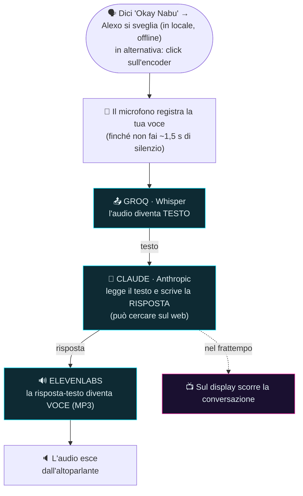
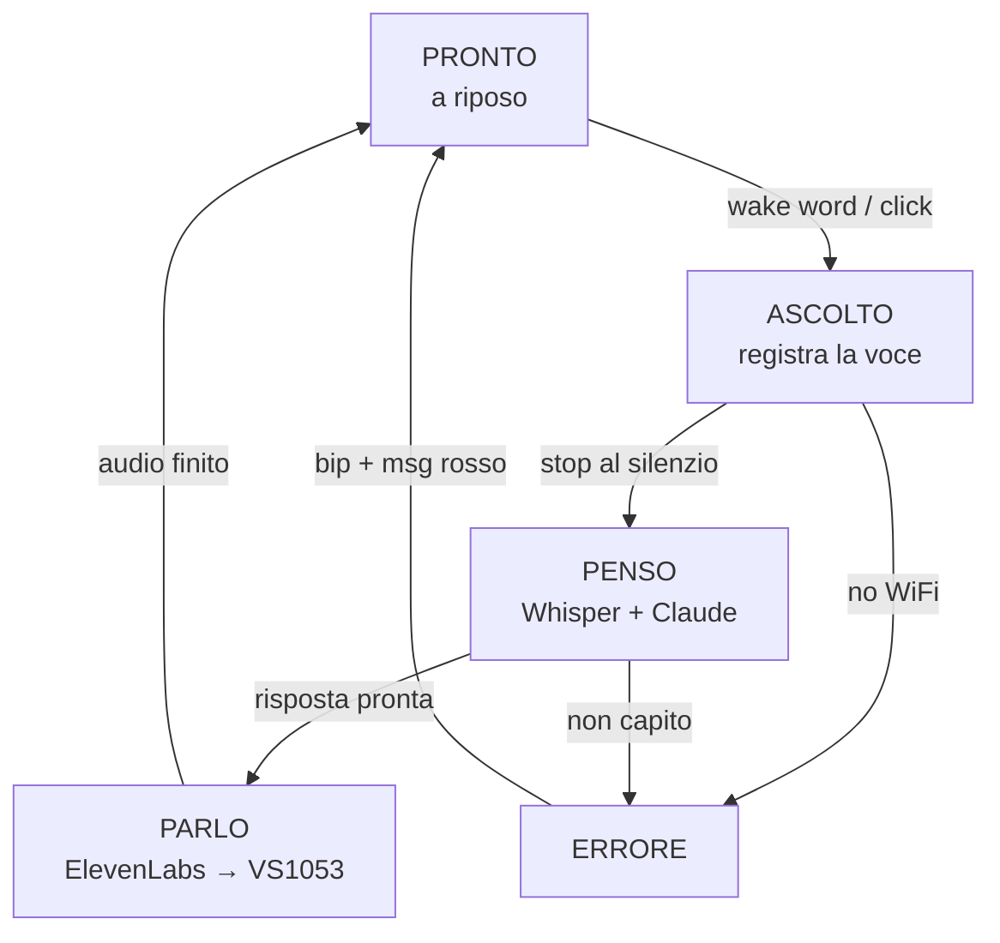
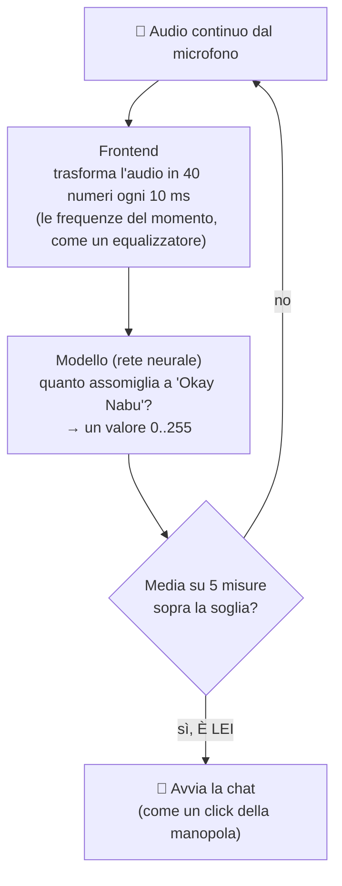

# MANUALE DI REALIZZAZIONE — ALEXO

**Assistente vocale "tipo Alexa" fai-da-te su ESP32-S3.**

Questo manuale spiega **come è fatto Alexo**, sia dal lato dei **collegamenti
elettrici** (cosa si salda a cosa e perché) sia dal lato del **programma** (cosa
fa ogni pezzo di codice). È scritto per essere capito anche senza essere esperti:
ogni concetto difficile è spiegato con parole semplici e con un esempio.

> Questo manuale racconta anche il *perché* delle scelte, non solo il *come*: così,
> se qualcosa nel tuo montaggio è diverso, capisci dove mettere le mani.

---

## Indice

1. [Cos'è Alexo e come "ragiona"](#1-cosè-alexo-e-come-ragiona)
2. [La catena vocale spiegata semplice](#2-la-catena-vocale-spiegata-semplice)
3. [I componenti (la spesa) e a cosa servono](#3-i-componenti-la-spesa-e-a-cosa-servono)
4. [I collegamenti elettrici, pezzo per pezzo](#4-i-collegamenti-elettrici-pezzo-per-pezzo)
5. [Alimentazione e le "trappole" hardware da conoscere](#5-alimentazione-e-le-trappole-hardware-da-conoscere)
6. [Il software: come è organizzato](#6-il-software-come-è-organizzato)
7. [Le impostazioni fondamentali (config.h e secrets.h)](#7-le-impostazioni-fondamentali)
8. [Come funziona il programma, modulo per modulo](#8-come-funziona-il-programma-modulo-per-modulo)
9. [La "macchina a stati": il ciclo di vita di una domanda](#9-la-macchina-a-stati)
10. [La wake word "Okay Nabu" spiegata semplice](#10-la-wake-word-okay-nabu-spiegata-semplice)
11. [Compilare e caricare il firmware](#11-compilare-e-caricare-il-firmware)
12. [Diagnostica e risoluzione problemi](#12-diagnostica-e-risoluzione-problemi)
13. [Come personalizzare Alexo](#13-come-personalizzare-alexo)
14. [Il pannello impostazioni web](#14-il-pannello-impostazioni-web)
15. [La musica: ascoltare la web-radio](#15-la-musica-ascoltare-la-web-radio)

---

## 1. Cos'è Alexo e come "ragiona"

Alexo è un piccolo dispositivo che **ascolta una domanda a voce e risponde a
voce**, come Alexa o Google Home. La differenza è che ce lo siamo costruiti noi,
su un microcontrollore **ESP32-S3**.

Il "cervello" vero e proprio (l'intelligenza artificiale che capisce e risponde)
**non gira dentro Alexo**: gira nel cloud. Alexo da solo è troppo piccolo per
farlo. Quindi Alexo fa il **fattorino**: registra la tua voce, la manda su
Internet a dei servizi specializzati, riceve la risposta e la fa parlare.

**Analogia:** immagina un centralinista. Non sa lui la risposta, ma sa a chi
telefonare per averla, e poi te la riferisce. Alexo è quel centralinista.

L'unica cosa "intelligente" che Alexo fa **da solo, offline**, è accorgersi
quando dici la parola magica ("Okay Nabu") per svegliarsi. Quello sì, lo fa in
casa, senza Internet.

---

## 2. La catena vocale spiegata semplice

Quando fai una domanda, l'informazione passa attraverso una **catena** di
passaggi. Ogni freccia è una "telefonata" via Internet (HTTPS):



Perché tre servizi diversi e non uno solo?

- **Groq/Whisper** è bravissimo a trasformare **voce → testo** (si chiama STT,
  *Speech To Text*). Ed è gratis.
- **Claude** è il cervello: legge il testo e scrive la risposta. È bravo a
  *capire e ragionare*, ma lavora solo col testo, non con l'audio.
- **ElevenLabs** è bravissimo a trasformare **testo → voce** (si chiama TTS,
  *Text To Speech*), con una voce naturale (addirittura clonata dalla voce
  dell'utente).

Ognuno fa il mestiere che sa fare meglio. Alexo li mette in fila.

> **Servono 3 chiavi (API key)**: una per Groq, una per Anthropic (Claude), una
> per ElevenLabs. Sono come password personali per usare quei servizi. Si
> ottengono gratis/registrandosi sui rispettivi siti. Dove si mettono lo vediamo
> nel [capitolo 7](#7-le-impostazioni-fondamentali).

---

## 3. I componenti (la spesa) e a cosa servono

| Pezzo                    | Modello                      | A cosa serve (in parole semplici)                                                                                                                                                                                                                                                       |
| ------------------------ | ---------------------------- | --------------------------------------------------------------------------------------------------------------------------------------------------------------------------------------------------------------------------------------------------------------------------------------- |
| **Cervello elettronico** | ESP32-S3 **N16R8**           | Il microcontrollore. È il "computer" che coordina tutto. Ha WiFi integrato, 16 MB di memoria flash (dove sta il programma) e 8 MB di PSRAM (memoria di lavoro, dove tiene l'audio registrato).                                                                                          |
| **Microfono**            | **ICS-43434** (I2S)          | L'orecchio. È un microfono *digitale*: manda già i numeri, non un segnale analogico da interpretare → più pulito.                                                                                                                                                                       |
| **Decoder audio**        | **VS1003/VS1053** (SPI)      | La "scheda audio". Riceve un flusso MP3 (la voce di ElevenLabs, oppure una **web-radio**) e lo trasforma in suono vero. L'ESP32 da solo non saprebbe suonare un MP3. ⚠️ Decodifica **solo MP3** (niente AAC): conta per le radio, vedi [cap. 15](#15-la-musica-ascoltare-la-web-radio). |
| **Amplificatore**        | **PAM8302A**                 | Alza il volume del segnale del VS1053 abbastanza da far suonare l'altoparlante. Da solo il decoder è troppo debole.                                                                                                                                                                     |
| **Altoparlante**         | uno qualsiasi piccolo        | La bocca. Emette il suono.                                                                                                                                                                                                                                                              |
| **Display**              | **ST7735** TFT 1.8" a colori | Lo schermo. Mostra la chat (le tue domande e le risposte) come un teleprompter che scorre.                                                                                                                                                                                              |
| **Anello LED**           | **WS2812** 12 LED (NeoPixel) | Le "luci di stato". Cambiano animazione a seconda di cosa sta facendo Alexo (ascolta, pensa, parla).                                                                                                                                                                                    |
| **Manopola**             | **Encoder rotativo** KY-040  | Il comando fisico. Si clicca per avviare/fermare, si gira per scorrere la chat o cambiare volume.                                                                                                                                                                                       |

> Nota storica: all'inizio si era provato un microfono analogico **MAX4466** e un
> pulsante separato. Il codice supporta ancora il MAX4466 (basta cambiare
> un'impostazione), ma la versione attuale usa il microfono digitale ICS-43434 e
> l'encoder come unico comando.

---

## 4. I collegamenti elettrici, pezzo per pezzo

> ⚠️ **Regola d'oro:** i numeri dei pin dell'ESP32 li decidiamo noi nel file
> [`include/config.h`](include/config.h). Quel file è l'**unica fonte di
> verità**: se ricabli qualcosa, cambi *solo* lì e tutto il resto del programma
> si adegua da solo. Le tabelle qui sotto rispecchiano i valori attuali di
> `config.h`.

Prima due concetti che tornano sempre:

- **GPIO** = "General Purpose Input/Output", cioè i piedini programmabili
  dell'ESP32. Ognuno ha un numero (es. GPIO14). Alcuni sono "speciali" e vanno
  evitati (lo spieghiamo sotto).
- **Bus SPI / I2S** = "autostrade" di comunicazione. Più dispositivi possono
  condividere la stessa autostrada, ma serve un pilota. Alexo usa **due bus SPI
  separati** apposta (uno per l'audio, uno per il display) così non si intralciano.

### 4.1 Microfono ICS-43434 (bus I2S)

Il microfono digitale parla la lingua **I2S** (tre fili di segnale + alimentazione).

| Pin del microfono | Va a…     | Note                                              |
| ----------------- | --------- | ------------------------------------------------- |
| VDD               | **3V3**   | alimentazione 3,3 V                               |
| GND               | **GND**   | massa                                             |
| SCK (clock)       | **GPIO5** | il "metronomo"                                    |
| WS (word select)  | **GPIO6** | dice quando è il turno del canale sinistro/destro |
| SD (dati)         | **GPIO7** | qui viaggiano i numeri dell'audio                 |
| L/R               | **GND**   | messo a massa = il mic usa il canale **sinistro** |

### 4.2 Decoder audio VS1053/VS1003 (bus SPI "audio", detto FSPI)

Questo è il pezzo più delicato da cablare. Condivide 3 fili (SCK, MOSI, MISO)
ma ha 4 fili di controllo tutti suoi.

| Pin del VS1053     | Va a…                    | A cosa serve                                 |
| ------------------ | ------------------------ | -------------------------------------------- |
| SCK                | **GPIO12**               | clock del bus SPI                            |
| MOSI (SI)          | **GPIO11**               | dati che vanno *verso* il chip               |
| MISO (SO)          | **GPIO13**               | dati che tornano *dal* chip                  |
| XCS                | **GPIO10**               | "chip select" per i **comandi**              |
| XDCS               | **GPIO21**               | "chip select" per i **dati** (il flusso MP3) |
| DREQ               | **GPIO18**               | il chip dice "sono pronto, dammi altri dati" |
| XRST               | **GPIO8**                | reset hardware del chip                      |
| LOUT / ROUT / AGND | → ingresso amplificatore | l'audio analogico che esce                   |
| Alimentazione      | **5V** e GND             |                                              |

> **Perché DREQ è su GPIO18 e XRST su GPIO8, e non altrove?** All'inizio erano
> su GPIO47 e GPIO38. Ma il **GPIO38** è collegato al LED di bordo della scheda:
> quel circuito "sporcava" il segnale di reset all'accensione e il chip audio a
> volte non si avviava (partenza "a freddo" inaffidabile). Spostandolo su GPIO8
> il problema è sparito. È un esempio di quanto la scelta dei pin conti.

### 4.3 Amplificatore PAM8302A

| Pin del PAM8302A   | Va a…                           | Note                                |
| ------------------ | ------------------------------- | ----------------------------------- |
| A+ / A− (ingresso) | **LOUT/ROUT + AGND del VS1053** | prende il suono debole dal decoder  |
| VCC                | **5V**                          | alimentazione                       |
| GND                | **GND**                         |                                     |
| SD (shutdown)      | **GPIO39**                      | accende/spegne l'ampli (vedi sotto) |
| uscita + / −       | **altoparlante**                |                                     |

> **Il trucco del pin SD (GPIO39).** L'amplificatore, quando è acceso e non c'è
> suono, fa un leggero "fruscio" fastidioso. Allora lo teniamo **spento a
> riposo** e lo **accendiamo solo un attimo prima di parlare**. Il pin SD è
> "attivo basso": mettere GPIO39 a livello ALTO = ampli acceso, a livello BASSO =
> ampli muto (consumo quasi zero, niente fruscio). Nel codice lo fa la funzione
> `ampEnable()`.

### 4.4 Display TFT ST7735 (bus SPI "display", detto HSPI — separato!)

| Pin del display             | Va a…      | Note                                 |
| --------------------------- | ---------- | ------------------------------------ |
| SCLK (SCL)                  | **GPIO2**  | clock (bus separato dall'audio)      |
| MOSI (SDA/DIN)              | **GPIO1**  | dati verso il display                |
| CS                          | **GPIO42** | chip select                          |
| DC (A0/RS)                  | **GPIO41** | "questo è un comando o un dato?"     |
| RST (RES)                   | **GPIO40** | reset                                |
| LED/BL (retroilluminazione) | **GPIO14** | accende/spegne la luce dello schermo |
| VCC                         | **3V3**    |                                      |
| GND                         | **GND**    |                                      |

> **Due dettagli furbi sul display:**
> 
> 1. **Bus separato (HSPI):** il display sta su un'autostrada tutta sua, diversa
>    da quella dell'audio. Così, mentre la chat scorre sullo schermo (gestita da
>    un "core" del processore), l'audio non fa singhiozzi (gestito dall'altro
>    core). Sono due lavoratori che non si pestano i piedi.
> 2. **Retroilluminazione su GPIO14:** invece di tenere la luce sempre accesa,
>    la pilotiamo noi. Dopo 2 minuti di inattività Alexo la **spegne** per
>    risparmiare, e la riaccende al primo comando. Il pin assorbe pochissimo
>    (~2 mA), quindi lo colleghiamo direttamente senza transistor.

### 4.5 Anello LED WS2812 (NeoPixel)

| Pin del ring | Va a…      |
| ------------ | ---------- |
| DIN (dati)   | **GPIO48** |
| 5V           | **5V**     |
| GND          | **GND**    |

> **Attenzione al filo dati (DIN):** i suoi impulsi elettrici possono
> "disturbare" i fili vicini. Va tenuto **lontano** dai fili del display (SCLK/
> MOSI). Se dà problemi (LED che lampeggiano a caso durante lo scroll), si può
> mettere una resistenza da ~330 Ω in serie sul DIN.

### 4.6 Encoder rotativo (la manopola)

| Pin dell'encoder | Va a…      | Note |
| ---------------- | ---------- | ---- |
| CLK (A)          | **GPIO16** |      |
| DT (B)           | **GPIO15** |      |
| SW (pulsante)    | **GPIO17** |      |
| +                | **3V3**    |      |
| GND              | **GND**    |      |

> Nota: se dopo il montaggio "orario" e "antiorario" risultano **invertiti** (capita
> facilmente scambiando i fili A e B), non è un problema: basta scambiare i due pin
> `CLK` e `DT` in `config.h`.

---

## 5. Alimentazione e le "trappole" hardware da conoscere

### 5.1 Come si alimenta

Il sistema si alimenta dai **5V** (ad esempio da un alimentatore USB). Il microfono
e il display vogliono **3,3 V**; il decoder audio, l'amplificatore e il ring vogliono
**5 V**. Entrambe le tensioni si prendono dalla scheda ESP32 (che ha sia il pin 3V3 sia
il 5V), con la **massa (GND) in comune** a tutto.

> Se alimenti dal pin **5V** della DevKitC-1, verifica sul tuo modello se quel pin è già
> collegato al rail interno o se serve chiudere un ponticello "IN-OUT" sulla scheda (su
> alcuni cloni dual-USB-C il 5V è isolato di default).

### 5.2 I condensatori di disaccoppiamento (importantissimi!)

**Problema scoperto sul campo:** quando i LED del ring si accendono, "succhiano"
corrente a strappi. Questi strappi, viaggiando sull'alimentazione, arrivavano
fino al microfono e lo **sporcavano** di rumore. Risultato: le luci reattive al
suono impazzivano e la registrazione era disturbata.

**Soluzione:** due **condensatori** fanno da "serbatoio d'acqua" che assorbe gli
strappi e tiene stabile la tensione:

- **470 µF** sul VCC del microfono
- **1000 µF** sul 5V del ring LED

> Analogia: è come mettere una cisterna vicino a un rubinetto che viene aperto e
> chiuso di continuo. La cisterna assorbe i colpi e a valle l'acqua resta stabile.

### 5.3 Altre due trappole risolte (utili da sapere)

1. **Il fading dei LED "a scatti".** Impostare la luminosità globale dei NeoPixel
   a un valore basso *quantizza* le sfumature (restano pochi livelli, il fading si
   vede a gradoni). Soluzione: tenere la luminosità globale al **massimo (255)** e
   usare valori bassi **direttamente** nei colori delle animazioni.
2. **Il primo "bip" e poi silenzio.** Il decoder VS1053, quando gli mandi il
   comando `stopSong()` su suoni molto brevi, si "incanta". Soluzione: non usare
   `stopSong()`; invece si mandano i dati del suono seguiti da un po' di
   **silenzio** (byte a zero) che spinge fuori l'ultimo pezzo. Lo stesso trucco
   vale per la voce e per i bip.

---

## 6. Il software: come è organizzato

Il programma è scritto in **C++** con l'ambiente **PlatformIO** (dentro VS Code).
È diviso in tanti file piccoli, ognuno con un compito. Questo si chiama
"modularità": è come una cucina dove ogni cuoco fa un piatto.

```
include/               ← le "etichette" (dichiarazioni) + le impostazioni
  config.h             ← ★ TUTTI i pin e i parametri. Si modifica QUI.
  secrets.example.h    ← modello per le password/chiavi (da copiare in secrets.h)
  *.h                  ← una "etichetta" per ogni modulo sotto

src/                   ← il codice vero e proprio
  main.cpp             ← il DIRETTORE D'ORCHESTRA: coordina tutto
  mic.cpp              ← registra dal microfono
  net.cpp              ← si connette al WiFi
  stt.cpp              ← manda l'audio a Groq → riceve il testo
  llm.cpp              ← manda il testo a Claude → riceve la risposta
  tts.cpp              ← manda la risposta a ElevenLabs → suona la voce
  music.cpp            ← riproduce la web-radio (flusso MP3 → VS1053)
  ui.cpp               ← anima l'anello LED
  gobbo.cpp            ← disegna la chat sul display
  encoder.cpp          ← legge la manopola
  volume.cpp           ← gestisce il volume (e lo ricorda)
  sound.cpp            ← genera i "bip" di conferma
  netlog.cpp           ← invia i log via rete (per leggerli senza cavo USB)
  settings.cpp         ← parametri modificabili "a caldo", salvati in memoria (NVS)
  webui.cpp            ← il web server del pannello impostazioni
  wakeword.cpp         ← riconosce "Okay Nabu" (l'unica IA locale)

data/                  ← file serviti dal web server (via LittleFS)
  index.html           ← la pagina del pannello impostazioni
```

**Due "core" (due cervelli nel processore).** L'ESP32-S3 ha due nuclei di
calcolo. Alexo li usa così:

- **Core 1**: fa la pipeline pesante (registrazione + telefonate a Internet).
- **Core 0**: fa le animazioni (LED, display, lettura encoder).

Perché? Perché le telefonate a Internet **bloccano** chi le fa per qualche
secondo. Se le animazioni fossero sullo stesso core, si congelerebbero. Tenendole
su un core separato, restano fluide anche mentre Alexo "pensa".

---

## 7. Le impostazioni fondamentali

### 7.1 `config.h` — i pin e i comportamenti

È il pannello di controllo. Alcuni esempi di cose che si regolano lì:

- I **numeri dei pin** di ogni componente (capitolo 4).
- `MIC_USE_I2S` → `1` usa il mic digitale, `0` il vecchio analogico.
- `IDLE_REACTIVE` → `1` fa "ballare" i LED col suono quando Alexo è a riposo.
- `REC_SILENCE_MS 1500` → dopo 1,5 s di silenzio la registrazione si chiude da sola.
- `REC_MAX_MS 20000` → non registra mai più di 20 secondi.
- `WAKE_ENABLE 1` → attiva la wake word "Okay Nabu".
- `DISPLAY_SLEEP_MS 120000` → spegne lo schermo dopo 2 minuti di inattività.
- Vari flag di **diagnostica** (`MIC_DIAG`, `WAKE_TEST`, `TFL_SELFTEST`) che
  vedremo nel capitolo 12.

### 7.2 `secrets.h` — le password (NON si condivide!)

Le credenziali WiFi e le 3 chiavi API stanno in un file a parte,
`include/secrets.h`, che **non viene mai messo online** (è escluso da git). Si
crea copiando il modello:

```
include/secrets.example.h   →   copia e rinomina in   →   include/secrets.h
```

E dentro si compilano i valori veri:

```cpp
#define WIFI_SSID        "il-nome-del-tuo-wifi"
#define WIFI_PASSWORD    "la-tua-password"
#define GROQ_API_KEY       "gsk_..."     // per Whisper (voce→testo), gratis
#define ANTHROPIC_API_KEY  "sk-ant-..."  // per Claude (il cervello)
#define ELEVENLABS_API_KEY "sk_..."      // per la voce (testo→voce)
```

> ⚠️ Le chiavi API sono come password: **mai** metterle in file pubblici o
> condividerle. Se una si "brucia", si rigenera dal sito del servizio.

### 7.3 La configurazione critica anti "boot loop"

C'è un dettaglio nel file `platformio.ini` che **non va toccato**. La scheda
N16R8 ha 16 MB di flash, ma il "profilo" standard la crede da 8 MB. Senza queste
righe il dispositivo entra in **boot loop** (si riavvia all'infinito):

```ini
board_upload.flash_size  = 16MB           ; dice la verità sulla dimensione
board_upload.maximum_size = 16777216
board_build.arduino.memory_type = qio_opi ; attiva gli 8 MB di PSRAM
```

Se un giorno vedi solo messaggi strani e continui riavvii sulla seriale, il
sospetto numero uno è questo.

---

## 8. Come funziona il programma, modulo per modulo

### `mic.cpp` — l'orecchio

Registra l'audio dal microfono a **16.000 campioni al secondo** (è la "risoluzione"
che vuole Whisper) e lo mette nella PSRAM (la memoria grande).

Cose intelligenti che fa:

- **Passa-alto ~120 Hz:** un filtro che toglie i rumori bassi (il "rimbombo" e
  la componente continua del microfono), lasciando passare la voce. È il
  segreto che ha reso la registrazione pulita.
- **Stop automatico al silenzio (adattivo):** mentre registri, misura l'energia
  media del suono; se sente 1,5 s di silenzio *dopo* che hai parlato, chiude da
  sola. Così non devi premere "stop". La soglia che distingue "voce" da "silenzio"
  **non è fissa**: si calcola sopra il rumore di fondo stimato in tempo reale
  (`soglia = fondo × margine + minimo`), così si adatta da sola se cambia il
  rumore ambientale (una stanza più o meno rumorosa). Usa la media (RMS) e non il
  picco, perché i rumori impulsivi (un colpo, una folata d'aria sul microfono) fanno
  picchi isolati altissimi che ingannerebbero il picco ma non la media. Questi due
  valori (`margine` e `minimo`) sono regolabili dal
  [pannello web](#14-il-pannello-impostazioni-web).
- **Livello per i LED:** dallo stesso audio calcola quanto "forte" stai parlando,
  per far reagire l'anello luminoso. Usa un "envelope follower" (un valore che
  sale piano e scende piano) per evitare che i LED sfarfallino sui rumori isolati.
- **"Ho sentito voce vera?"** Tiene traccia se durante la registrazione il suono ha
  davvero superato la soglia (`micHeardVoice`). Serve alla difesa anti-fantasma
  (vedi sotto).

#### Il filtro anti-fantasma di Whisper

Ogni tanto capita un **falso avvio** (la wake word che si ri-attiva sulla coda
audio, o un disturbo): parte una registrazione che contiene solo silenzio/rumore.
Il riconoscitore vocale (Whisper), messo davanti al silenzio, **"allucina"**: in
italiano quasi sempre inventa *"Grazie"*, *"Grazie a tutti"* o *"Sottotitoli a cura
di…"*. Il risultato era che Alexo faceva partire una risposta dal nulla.

Due difese (in `main.cpp`):

1. **Se non è stata sentita voce vera**, Alexo torna a riposo **senza nemmeno
   chiamare Whisper** (usa `micHeardVoice`). Taglia il problema alla radice.
2. **Filtro sulle frasi-fantasma:** se comunque la trascrizione è *esattamente* una
   frase-fantasma nota, la scarta in silenzio. La **lista è modificabile dal
   [pannello web](#14-il-pannello-impostazioni-web)**, così ne aggiungi di nuove
   senza ricompilare.

### `net.cpp` — il WiFi

Si collega alla rete di casa usando le credenziali di `secrets.h`. Serve una rete
a **2,4 GHz** (l'ESP32 non parla il 5 GHz).

Fa anche una cosa fondamentale per gli orari: **sincronizza l'orologio via NTP**
(un servizio Internet che dà l'ora esatta), impostando il fuso italiano con il
cambio ora legale automatico. Da qui `nowContextString()` produce la stringa
data/ora (locale + UTC) che finisce nel cervello (`llm.cpp`). Senza NTP, l'ESP32
partirebbe dal 1970 e Claude non saprebbe che ora è.

### `stt.cpp` — da voce a testo (STT)

Prende l'audio registrato (in formato WAV), lo impacchetta in una richiesta web
"multipart" (come allegare un file a un modulo) e lo invia a **Groq**. Groq usa
il modello **Whisper** e restituisce il testo di ciò che hai detto. Alexo estrae
il campo `text` dalla risposta.

### `llm.cpp` — il cervello (Claude)

Il pezzo più "intelligente". Invia il tuo testo all'API di **Anthropic** (modello
`claude-haiku-4-5`, veloce ed economico) e riceve la risposta. Punti chiave:

- **System prompt:** una "istruzione permanente" dice a Claude di essere Alexo,
  di rispondere breve e colloquiale (2-3 frasi, niente elenchi né emoji, perché
  poi va letto ad alta voce).
- **Memoria della conversazione:** conserva gli ultimi 8 messaggi, così puoi fare
  domande di seguito ("e a Milano?" dopo aver chiesto il meteo di Roma). Dopo 2
  minuti di inattività la memoria si azzera (nuova conversazione).
- **Ricerca web:** Claude può cercare su Internet da solo (meteo, notizie,
  prezzi) fino a 3 volte per domanda. Alexo poi legge solo il riassunto.
- **Data e ora reali:** a ogni domanda, Alexo aggiunge al system prompt la data e
  l'ora attuali (locale + UTC), prese dall'orologio sincronizzato via Internet
  (vedi `net.cpp`). Senza, Claude **non sa che ora è adesso** e sbaglierebbe sia
  "che ore sono" sia il calcolo dei fusi delle altre città (che ricava dall'UTC).

### `tts.cpp` — da testo a voce (TTS)

Manda la risposta a **ElevenLabs**, che restituisce un file **MP3** con la voce.
L'MP3 non arriva tutto insieme: arriva "a pezzetti" (streaming) e ogni pezzetto
viene subito passato al decoder VS1053. Così la voce parte prima ancora di aver
scaricato tutto (bassa latenza).

Fa anche una **normalizzazione per la pronuncia**: trasforma i simboli e i formati
che il lettore sbaglierebbe. Esempi: "36°C" → "36 gradi centigradi", "19,5" → "19
virgola 5", "100%" → "100 per cento". (Sul display resta scritto normale, la
trasformazione è solo per la voce.)

Include anche la **lettura degli orari** (funzione `leggiOrario`): "12:30" →
"12 e 30", "00:00" → "mezzanotte", "12:00" → "mezzogiorno", "14:00" → "14 in
punto", "00:30" → "zero 30". Senza, il lettore direbbe "dodici due punti trenta".

### `music.cpp` — la web-radio

Riproduce una **radio via Internet** (un flusso MP3 continuo) sull'altoparlante,
riusando lo stesso decoder VS1053 della voce. Dici *"metti radio Kiss Kiss"* (o un
genere, *"metti musica jazz"*) e Alexo apre lo stream e lo suona finché non lo fermi.

Come funziona in breve:

- Il flusso MP3 arriva "a pezzetti" dalla rete e viene passato di continuo al VS1053
  (come la voce, ma senza fine). Supporta stream **http e https** (le radio italiane
  moderne sono quasi tutte in https).
- Le stazioni sono una **lista modificabile dal [pannello web](#14-il-pannello-impostazioni-web)**
  (nome + parola per chiamarla + indirizzo). Chi le sceglie è o il riconoscimento
  diretto della parola, oppure Claude (con uno strumento apposta) se chiedi un genere.
- Mentre suona, l'anello LED "balla" col ritmo (il microfono sente la cassa).
- ⚠️ **Solo MP3:** il VS1053 non sa decodificare l'AAC né le playlist HLS (`.m3u8`),
  formati usati da molte radio. Per questo non tutte le emittenti funzionano: gli
  indirizzi vanno scelti in formato MP3 (vedi [cap. 15](#15-la-musica-ascoltare-la-web-radio)).

### `ui.cpp` — le luci di stato

Un piccolo programma che gira sul core 0 e disegna sull'anello LED ~40 volte al
secondo. A ogni stato corrisponde un'animazione:

- **pronto (idle):** LED spenti, oppure che "ballano" col suono se `IDLE_REACTIVE`.
- **ascolto:** una barra che si riempie da verde a rosso col volume della voce.
- **penso:** una cometa viola-ciano che gira.
- **parlo:** una pulsazione verde-acqua.
- **errore:** lampeggio rosso.
- **OTA (aggiornamento):** cometa verde.

> Tutte le animazioni sono "basate sul tempo" (`millis()`): restano fluide anche
> se qualche fotogramma salta.

### `gobbo.cpp` — la chat sul display

"Gobbo" è il gergo per il **teleprompter**. Mostra la conversazione ("Tu: …" in
giallo, "Alexo: …" in bianco) e la fa scorrere. Trucchi:

- Disegna tutto prima in una **memoria d'appoggio** e poi lo copia sullo schermo
  in un colpo solo → niente sfarfallio.
- Durante la risposta, **sincronizza lo scorrimento con la voce**: la riga che
  Alexo sta "leggendo" resta più o meno al centro.
- Converte gli accenti italiani (à, è, ì, ò, ù…) nel formato del font del display.
- **Gestisce anche l'encoder** (perché sta sullo stesso core): girando scorri la
  chat, cliccando avvii/fermi.
- **Schermata OTA:** durante un aggiornamento via WiFi mostra una videata dedicata
  in stile HUD verde con la **percentuale grande al centro** e una barra di
  avanzamento (`renderOtaScreen`). La disegna questo task (unico che può toccare lo
  schermo); il codice che riceve l'aggiornamento gli passa solo la percentuale.
- **Copia della chat per il pannello web:** tiene anche una copia leggera degli
  ultimi 40 messaggi (in testo "pulito"), che il [pannello web](#14-il-pannello-impostazioni-web)
  mostra nella sua card "Chat". Un contatore segnala quando arriva un messaggio nuovo,
  così il browser aggiorna la chat **solo a fine messaggio**, senza ricaricare a vuoto.

### `encoder.cpp` — la manopola

Legge la manopola con una libreria dedicata, interrogandola ogni millisecondo su
un task apposta (così non perde scatti). Gestisce **quattro gesti**:

- **click** = avvia / ferma la chat
- **doppio click** = accende/spegne i LED reattivi al suono
- **premuto + giro** = volume
- **giro** = scorri la chat

> Piccola complicazione risolta: la libreria segnala un "click" anche al primo dei
> due click di un doppio. Per distinguerli, il click singolo viene **ritardato di
> ~350 ms**: se entro quel tempo arriva un secondo click è un "doppio", altrimenti
> era un "singolo".

> **Mentre suona la radio i gesti cambiano** (siamo nello stato "musica"): il
> **click** passa alla **stazione successiva**, il **doppio click esce** dalla radio
> e torna alla chat, e il **giro** (nudo o premuto) regola il **volume**. Così scorri
> le emittenti come i preset di un autoradio.

### `volume.cpp` — il volume che si ricorda

Regola il volume del decoder e lo **salva nella memoria permanente (NVS)**, così
sopravvive ai riavvii. Il cambio richiesto dalla manopola (core 0) viene applicato
dal core 1 in modo sicuro.

### `sound.cpp` — i bip di conferma

Genera al volo dei toni (un "bip" acuto per "inizio ascolto", uno grave per
"stop", due gravi per "errore"). Non sono file: sono onde sinusoidali calcolate
sul momento e passate al decoder.

### `netlog.cpp` — leggere i log senza cavo

Quando non hai il cavo USB a portata (o Alexo è già montato e installato), i messaggi
di debug puoi leggerli **via rete**: questo modulo li manda anche lì. Ci si collega con
`telnet alexo.local` (porta 23) e si
leggono da un altro computer. Non disturba l'aggiornamento OTA.

### `settings.cpp` — i parametri che si possono cambiare "a caldo"

Molti valori (soglie del microfono, wake word, volume, voce, personalità di
Claude…) una volta erano "scolpiti" nel codice: per cambiarli bisognava
ricompilare. Ora vivono in una **struttura in memoria** (`gSettings`) che all'avvio
viene **caricata dalla memoria permanente (NVS)**; se non c'è nulla di salvato, usa
i valori di fabbrica scritti in `config.h`. Sono i parametri che si regolano dal
[pannello web](#14-il-pannello-impostazioni-web). "Ripristina default" li riporta
ai valori di fabbrica.

### `webui.cpp` — il pannello web

Un piccolo **server web** (porta 80) che serve la pagina delle impostazioni (il
file `data/index.html`, che vive nella memoria flash tramite un file-system
chiamato **LittleFS**) ed espone una piccola "API" per leggere e salvare i
parametri, per la lettura live del microfono, per fermare la musica e per **mostrare
la chat** nel browser. Vedi il [capitolo 14](#14-il-pannello-impostazioni-web).

---

## 9. La macchina a stati

Il cuore del `main.cpp` è una **macchina a stati**: in ogni momento Alexo si
trova in *uno* stato, e passa al successivo quando succede qualcosa. È come un
gioco dell'oca con caselle fisse.



> A riposo (**PRONTO / idle**) il ring è spento o reattivo al suono.

Nel codice, la funzione `runInteraction()` esegue una singola conversazione d
inizio-a-fine, e la funzione `setState()` aggiorna **insieme** le luci (`ui.cpp`)
e l'intestazione del display (`gobbo.cpp`). Il `loop()` principale, oltre a
lanciare `runInteraction()` quando serve, tiene vivo l'OTA, applica i cambi di
volume e ascolta di continuo il microfono per la wake word.

> C'è anche uno stato in più, **MUSICA**: quando chiedi una radio, Alexo entra qui
> e ci resta a suonare finché non lo fermi (doppio click o dal pannello). In questo
> stato la manopola comanda la radio (vedi [`encoder.cpp`](#encodercpp--la-manopola)),
> non la chat.

---

## 10. La wake word "Okay Nabu" spiegata semplice

Questa è l'**unica intelligenza che gira dentro Alexo**, senza Internet. Serve a
farlo svegliare quando dici la parola magica, senza dover toccare la manopola.

**Come fa a "sentire" una parola senza capire il linguaggio?** Usa una minuscola
rete neurale (un "modello" già addestrato) che gira grazie a **TensorFlow Lite
Micro**, una versione dell'IA fatta apposta per i chip piccoli.

Il percorso, semplificato:



**Perché "Okay Nabu" e non "Alexo"?** Perché "Okay Nabu" è un modello **già
pronto** (scaricato, molto preciso) e si pronuncia bene. Le parole
inglesi provate prima non andavano ("hey jarvis" non veniva colto per l'accento,
"alexa" scattava su qualsiasi parola che finiva in "-xa"). La parola **"Alexo"
personalizzata** è il prossimo upgrade: bisogna *addestrare* un modello nuovo (si
fa online con Google Colab, usando voci sintetiche, in circa mezz'ora) e poi
sostituire il file del modello.

**Tre lezioni imparate** (utili se ci metti mano):

1. Il modello è di tipo *streaming*: vuole un **flusso continuo** di audio, senza
   pause. Se metti dei ritardi tra una lettura e l'altra, non riconosce più nulla.
2. **Troppo guadagno satura** e peggiora il riconoscimento. Meglio non esagerare.
3. **Dopo ogni conversazione** bisogna "svuotare" l'audio accumulato
   (`micFlush()` + `wakeReset()`), altrimenti Alexo si ri-sveglia da solo sentendo
   la propria risposta appena finita di parlare.

> Il procedimento per **addestrare una wake word personalizzata** (es. "Alexo") si fa
> online con Google Colab, usando voci sintetiche, in circa mezz'ora; poi si sostituisce
> il file del modello nel progetto.

---

## 11. Compilare e caricare il firmware

Il progetto si compila con **PlatformIO**. I comandi qui sotto sono `pio` "puro"; se
usi PlatformIO dentro VS Code trovi gli stessi pulsanti (Build / Upload) nell'interfaccia.

**Compilare** (creare il firmware dai sorgenti):

```
pio run -e esp32-s3-devkitc-1
```

### Primo caricamento: via USB

La **prima volta** (scheda nuova) si carica **via cavo USB**: colleghi l'ESP32 al
computer e lanci l'upload sulla porta seriale.

```
pio run -e esp32-s3-devkitc-1 -t upload
```

> Su Windows, se `pio` non è nel PATH, chiamalo col percorso completo
> (`%USERPROFILE%\.platformio\penv\Scripts\pio.exe`). Prima di caricare via USB chiudi
> l'eventuale monitor seriale, altrimenti la porta risulta occupata ("Accesso negato").

### Caricamenti successivi: via WiFi (OTA), se preferisci

Una volta che Alexo è sul WiFi, puoi aggiornarlo **senza cavo**, "over the air": comodo
se è già installato o in un punto scomodo da raggiungere. Nel `platformio.ini` si
impostano le righe per l'upload OTA verso `alexo.local` (il nome di rete di Alexo) al
posto di quelle per l'USB. La board dev'essere accesa, connessa al WiFi e a riposo.

Durante l'aggiornamento OTA, sul display appare una **schermata dedicata** (HUD verde con
la percentuale grande al centro e la scritta "NON SPEGNERE"), così vedi l'avanzamento a
colpo d'occhio.

> **Se hai modificato la pagina del pannello web** (`data/index.html`), oltre al firmware
> devi caricare anche il file-system con `... -t uploadfs`. Via OTA, aspetta che
> `alexo.local` torni online dopo il riavvio del firmware prima di lanciarlo. Vedi il
> [capitolo 14](#14-il-pannello-impostazioni-web).

**Backup pronti:** nella cartella [`firmware_demo/`](firmware_demo/) ci sono versioni
`.bin` già compilate e funzionanti, per tornare in fretta a una build buona se un
esperimento va storto.

---

## 12. Diagnostica e risoluzione problemi

### 12.1 Leggere cosa dice Alexo

- **Via USB:** monitor seriale a 115200 baud sulla porta dell'ESP32.
- **Via WiFi** (senza cavo): `telnet alexo.local` (porta 23) — vedi `netlog.cpp`.

### 12.2 I flag di diagnostica in `config.h`

Mettendo uno di questi a `1` (e ricaricando il firmware), Alexo entra in una modalità
speciale che **non avvia la chat** ma resta comunque aggiornabile. Per uscire: si
rimette a `0` e si ricarica.

| Flag           | Cosa fa                                                                                                                                                                             |
| -------------- | ----------------------------------------------------------------------------------------------------------------------------------------------------------------------------------- |
| `MIC_DIAG`     | Misura il rumore del microfono e stampa i livelli: serve a scegliere il guadagno giusto e a capire se un rumore è "software" (bassa frequenza, si filtra) o "hardware" (massa/EMI). |
| `TFL_SELFTEST` | Prova che il motore di IA (TensorFlow Lite Micro) funzioni, con un modellino di test.                                                                                               |
| `WAKE_TEST`    | Prova la catena della wake word e stampa la "probabilità" mentre parli: utile per tarare la soglia.                                                                                 |

### 12.3 Problemi tipici e prima cosa da controllare

| Sintomo                                              | Sospetto numero uno                                                                                                             |
| ---------------------------------------------------- | ------------------------------------------------------------------------------------------------------------------------------- |
| Si riavvia all'infinito, solo messaggi ROM           | Config anti boot-loop in `platformio.ini` (cap. 7.3)                                                                            |
| PSRAM = 0 byte                                       | Manca `memory_type = qio_opi`                                                                                                   |
| Non si connette al WiFi                              | Rete a 5 GHz (serve 2,4 GHz) o credenziali sbagliate in `secrets.h`                                                             |
| Trascrive "Grazie" a caso / riparte una chat da sola | Falso avvio + allucinazione di Whisper sul silenzio — ora filtrata (skip se non sente voce + lista frasi-fantasma nel pannello) |
| I LED lampeggiano a vuoto a riposo                   | Manca il filtro passa-alto o i condensatori di disaccoppiamento                                                                 |
| Solo il primo bip suona                              | Uso di `stopSong()` su toni brevi (cap. 5.3)                                                                                    |
| Il chip audio a freddo non parte                     | Reset (XRST) disturbato — vedi scelta GPIO8 (cap. 4.2)                                                                          |
| Alexo si risveglia da solo dopo aver parlato         | Manca `micFlush()`/`wakeReset()` a fine interazione                                                                             |

### 12.4 Il metodo: isola una variabile

Quando qualcosa si rompe, **cambia una cosa alla volta** e verifica. Non toccare
tre parametri insieme: se poi funziona (o non funziona) non sai quale è stato.
È il modo più veloce per trovare il colpevole.

---

## 13. Come personalizzare Alexo

> 💡 **La via più comoda:** quasi tutto ciò che segue si può ormai cambiare dal
> [pannello web](#14-il-pannello-impostazioni-web) (voce, voce alternativa +
> trigger, modello e personalità di Claude, soglie mic/wake, volume, easter-egg),
> **senza ricompilare**. Sotto restano i riferimenti nel codice per chi vuole
> cambiare i valori di *fabbrica* o toccare cose non esposte nel pannello.

Tutto senza toccare la logica, solo pochi valori:

- **Cambiare la voce (default di fabbrica):** in [`include/config.h`](include/config.h)
  ci sono `ELEVEN_VOICE_DEF`, la voce alternativa `ELEVEN_VOICE_ALT_DEF` e la
  parola-trigger `VOICE_TRIGGER_DEF`. (Dal pannello web cambi i valori *attivi*
  senza ricompilare, e le parole-trigger possono essere più d'una.)
- **Rendere Alexo più "intelligente" (default):** `LLM_MODEL_DEF` in `config.h`.
  Tre scelte: `claude-haiku-4-5` (veloce/economico), `claude-sonnet-5` (equilibrato)
  e `claude-opus-4-8` (il più intelligente, più lento/costoso). Dal pannello lo
  cambi al volo. Per la voce conviene la velocità → Haiku o Sonnet.
- **Cambiare la personalità (default):** `SYSTEM_PROMPT_DEF` in `config.h` (o dal
  pannello). È il testo che descrive chi è Alexo e come deve rispondere.
- **Regolare i tempi/soglie di registrazione:** `REC_SILENCE_MS`,
  `REC_SILENCE_MARGIN`, `REC_SILENCE_FLOOR`, `REC_MAX_MS` in `config.h` (i primi
  tre anche dal pannello).
- **Luci a riposo sì/no:** `IDLE_REACTIVE` in `config.h` (o dal pannello / doppio
  click encoder).
- **Comportamento LED reattivi (default):** `MIC_LVL_MARGIN_DEF`/`MIC_LVL_FLOOR_DEF`
  (soglia), `MIC_LVL_ATTACK_DEF` (reattività/salita) e `MIC_LVL_RELEASE_DEF`
  (permanenza/discesa) in `config.h` — tutti anche dal pannello.
- **Termini dell'easter-egg:** `EGG_TERMS_DEF` in `config.h` (o dal pannello).
- **Cambiare la wake word:** si sostituisce il file del modello `src/wake_model.h`
  (con quello di un'altra parola) e si aggiornano i parametri `WAKE_*` in `config.h`.
  Per addestrare una parola tutta tua vedi la nota in fondo al [capitolo 10](#10-la-wake-word-okay-nabu-spiegata-semplice).

---

## 14. Il pannello impostazioni web

Alexo ha un **pannello di controllo via browser**: apri `http://alexo.local/` da
telefono o PC collegati alla stessa rete WiFi. Da lì regoli i parametri **senza
ricompilare né ricaricare il firmware** — cambi un valore, premi "Salva", ed è
subito attivo e memorizzato (sopravvive ai riavvii).

### A cosa serve (la comodità vera)

Prima, per tarare (per esempio) la sensibilità al rumore di fondo, il ciclo era:
*modifica il codice → ricompila → ricarica → collega il Telnet → leggi*.
Adesso è: *sposti uno slider dal telefono e guardi l'effetto in tempo reale*.

### Cosa puoi regolare

- **Microfono · stop-al-silenzio · LED:** dopo quanti ms di silenzio chiudere la
  registrazione, il margine e il minimo della soglia adattiva (quelli che rendono
  Alexo robusto al rumore di fondo), le soglie dei LED reattivi (margine e minimo di
  accensione), la **reattività** (quanto in fretta i LED si accendono) e la
  **permanenza** (quanto in fretta si spengono), e l'accensione/spegnimento
  dell'effetto luminoso a riposo.
- **Wake word "Okay Nabu":** guadagno, soglia di attivazione, finestra della media
  (quanto dev'essere "sicuro" prima di svegliarsi).
- **Audio:** volume; la **voce** di default (Voice ID ElevenLabs); la **voce
  alternativa** e le sue **parole-trigger** (più d'una, separate da virgola: se la
  frase inizia con una di quelle, Alexo risponde con l'altra voce).
- **Cervello:** il **modello** di Claude (haiku = veloce, opus = più intelligente)
  e la **personalità** (il testo che descrive chi è Alexo e come deve rispondere).
- **Easter egg:** i **termini trigger** (separati da virgola) che fanno scattare
  la frase scherzosa; lascia vuoto per disattivarlo.
- **Filtro anti-fantasma (Whisper):** la lista delle **frasi-fantasma** da scartare
  (quelle che Whisper inventa sul silenzio, tipo "Grazie"); ne aggiungi di nuove se
  ne spunta qualcuna. Lascia vuoto per disattivare il filtro.
- **Musica (web-radio):** la **lista delle stazioni**, una per riga nel formato
  `parola | nome | indirizzo` (la *parola* è quella che dici, es. "virgin"; il *nome*
  è quello che appare a schermo; l'*indirizzo* è lo stream MP3). C'è anche un pulsante
  **"⏹ Ferma musica"** e lo stato di riproduzione. Dettagli su come scegliere gli
  indirizzi giusti nel [capitolo 15](#15-la-musica-ascoltare-la-web-radio).

### La lettura live del microfono (il pezzo forte)

In cima alla pagina c'è un riquadro che mostra, aggiornati ogni secondo:

- il **livello** di suono che il mic sente in questo momento,
- il **rumore di fondo** stimato da Alexo,
- la **soglia** di accensione (una tacca sulla barra),
- la **probabilità wake** (quanto "assomiglia" a Okay Nabu mentre parli),
- più WiFi e memoria libera.

Così tari le soglie **guardandole muoversi** — per esempio introduci un rumore di
fondo (musica, chiacchiericcio, un elettrodomestico), vedi dove si posiziona il
livello, e regoli i parametri sotto quel valore. Non serve più la modalità
`MIC_DIAG` col Telnet.

### La chat nel browser

Il pannello ha anche una card **"Chat"** che mostra la **stessa conversazione che
scorre sul display** (le tue domande e le risposte di Alexo, ultimi 40 messaggi), ma
a tutta larghezza e comoda da leggere/copiare dal telefono. Si aggiorna **da sola a
ogni nuovo messaggio** (non a intervalli fissi: un piccolo "contatore" avvisa il
browser solo quando c'è qualcosa di nuovo, così non ricarica a vuoto). È in **sola
lettura** — serve a *rivedere* la conversazione, non a scrivere da lì. La chat parte
vuota dopo un riavvio (come lo storico sul display, non è memorizzata).

### Come funziona sotto (in parole semplici)

- La pagina (`data/index.html`) è un file salvato nella flash tramite **LittleFS**.
  Il server web (`webui.cpp`) la serve al browser e risponde a delle richieste
  "API" per leggere/scrivere i valori.
- I valori vivono in `gSettings` (`settings.cpp`) e vengono **salvati in NVS**
  (la memoria permanente), così restano dopo lo spegnimento.
- Il server è "sincrono": mentre Alexo sta gestendo una domanda (registra o parla
  con Internet) il pannello per qualche secondo non risponde. È normale: il
  pannello si usa quando Alexo è a riposo.

### ⚠️ Aggiornare la pagina = due passi

Se modifichi **solo il codice** (`.cpp`/`.h`) basta il solito upload del firmware.
Ma se modifichi **la pagina** `data/index.html`, devi caricare *anche* il
file-system:

```
# 1) firmware
pio run -e esp32-s3-devkitc-1 -t upload
# 2) pagina (LittleFS)
pio run -e esp32-s3-devkitc-1 -t uploadfs
```

> Nota: se carichi via WiFi (OTA), dopo il punto 1 il dispositivo si riavvia; aspetta
> che `alexo.local` sia di nuovo raggiungibile prima di lanciare il punto 2.

---

## 15. La musica: ascoltare la web-radio

Oltre a rispondere alle domande, Alexo sa fare da **radio via Internet**: chiedi una
stazione o un genere e la suona sull'altoparlante.

### Come si usa

- **A voce:** *"metti radio Kiss Kiss"*, *"metti musica jazz"*, *"metti Virgin"*.
  Se dici una parola presente nella lista delle stazioni, parte quella; se chiedi un
  genere generico, è **Claude** a scegliere una radio adatta.
- **Mentre suona, con la manopola:**
  - **click** → stazione **successiva** (scorri le emittenti come i preset di un'autoradio)
  - **doppio click** → **esci** dalla radio e torna alla chat
  - **giro** → **volume** (a zero, l'amplificatore si spegne del tutto: niente fruscio)
- **Dal pannello web:** il pulsante **"⏹ Ferma musica"**.

### Le stazioni (e come aggiungerne)

La lista si modifica dal [pannello web](#14-il-pannello-impostazioni-web), una
stazione per riga:

```
virgin | Virgin Radio | http://icecast.unitedradio.it/Virgin.mp3
jazz   | Jazz          | http://listen.181fm.com/181-classicaljazz_128k.mp3
```

`parola | nome | indirizzo`. La *parola* è quella che pronunci; il *nome* appare a
schermo; l'*indirizzo* è il flusso della radio.

### ⚠️ La regola d'oro: solo indirizzi MP3

Il decoder VS1053 sa suonare **solo l'MP3**. Molte radio però trasmettono in **AAC**
o come **playlist HLS** (`.m3u8`): quelle **non funzionano**, anche se l'indirizzo
sembra giusto. È il motivo per cui alcune emittenti "famose" vanno scartate: non è un
difetto di Alexo, è il formato sbagliato. Quando cerchi un nuovo indirizzo, verifica
che sia uno stream **MP3** diretto.

### Perché alcune radio "gracchiano" (nota onesta)

Può capitare che una radio, pur essendo MP3 e pur partendo, si senta **a tratti**
mentre un'altra (identica come formato) vada liscia. In quel caso il problema **non è
Alexo**: è **come quel server consegna i dati** sulla rete WiFi. Alcuni server
"spingono" un cuscinetto di dati in anticipo (e reggono bene), altri mandano lo
stretto necessario in tempo reale (e al minimo intoppo del WiFi si sente a scatti).
La cosa pratica da fare è **tenere nella lista solo le radio che nella tua rete
suonano bene** (il log via Telnet mostra nome e bitrate di ognuna, utile per provarle).

> **Cosa NON si può fare:** Spotify, Amazon Music e Apple Music **non** sono
> accessibili (usano protocolli chiusi e protezioni anti-copia). E niente "metti la
> canzone X dell'artista Y" a comando: le web-radio trasmettono un palinsesto, non
> singoli brani a richiesta.

---

*Manuale del progetto Alexo. Tutti i pin e i parametri citati stanno in
[`include/config.h`](include/config.h), l'unica fonte di verità da modificare.*
