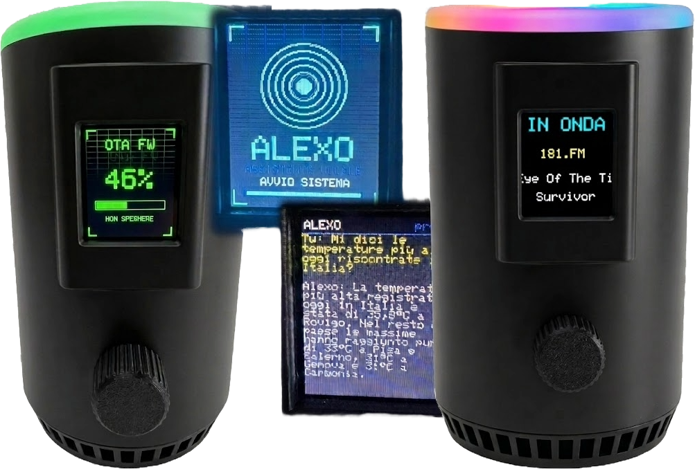
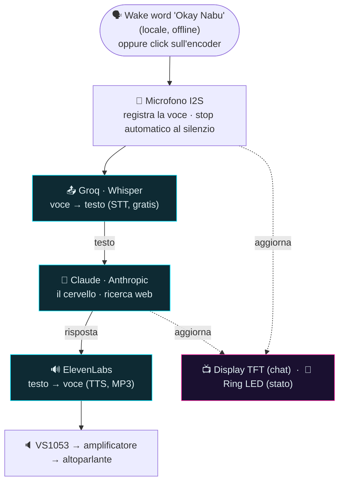

# Alexo — assistente vocale fai-da-te su ESP32-S3

Alexo è un assistente vocale "tipo Alexa/Google Home" **costruito da zero** su un
microcontrollore **ESP32-S3**: ascolta una domanda a voce e risponde a voce, con tanto
di chat sul display e animazioni luminose. Tutto il progetto (codice, commenti,
interfaccia) è in **italiano**.

<p align="center">
  
</p>

> ⚠️ **Progetto hobbistico/educativo.** Per funzionare servono **3 API key tue**
> (vedi sotto). Nessuna garanzia: usalo a tuo rischio.

---

## Come funziona

Alexo da solo è troppo piccolo per "ragionare": fa il **fattorino** tra alcuni servizi
cloud. L'unica intelligenza che gira in locale (offline) è il riconoscimento della parola
di attivazione.



Sul display TFT scorre la conversazione come un teleprompter; l'anello di LED cambia
animazione in base allo stato (ascolto / pensa / parla).

## Funzionalità

- 🗣️ **Wake word locale** "Okay Nabu" (microWakeWord / TensorFlow Lite Micro, offline)
- 🎛️ **Encoder** come comando unico (click per parlare, giro per scorrere/volume)
- 🧠 **Memoria della conversazione** + **ricerca web** (via Claude)
- ⏱️ **Stop automatico al silenzio** adattivo al rumore di fondo
- 📻 **Web-radio** MP3 ("metti radio…", cambio stazione dall'encoder)
- 🌐 **Pannello web** (`http://alexo.local/`): taratura parametri, volume, voci,
  personalità di Claude, e **chat in tempo reale** — senza ricompilare
- 🕒 **Ora reale** via NTP passata al cervello
- ⬆️ **Aggiornamento OTA** (via WiFi) oltre che via USB

## Hardware

| Componente    | Modello                                      | Ruolo                        |
| ------------- | -------------------------------------------- | ---------------------------- |
| MCU           | ESP32-S3 **N16R8** (16 MB flash, 8 MB PSRAM) | il "computer"                |
| Microfono     | **ICS-43434** (I2S)                          | l'orecchio                   |
| Decoder audio | **VS1053 / VS1003** (SPI)                    | riproduce MP3 (voce e radio) |
| Amplificatore | **PAM8302A**                                 | pilota l'altoparlante        |
| Display       | **ST7735** TFT 1.8" a colori                 | chat / teleprompter          |
| Anello LED    | **WS2812** 12 LED (NeoPixel)                 | animazioni di stato          |
| Comando       | Encoder rotativo **KY-040**                  | click / giro                 |

Schema dei collegamenti pin-per-pin e note di montaggio nel
[**MANUALE.md**](MANUALE.md) e in [CABLAGGIO_HW.md](CABLAGGIO_HW.md).

## Software

Firmware in **C++ / PlatformIO** (Arduino), modulare: `mic`, `net`, `stt`, `llm`, `tts`,
`music`, `ui` (LED), `gobbo` (display), `encoder`, `volume`, `sound`, `wakeword`,
`settings` + `webui` (pannello web). La pipeline pesante gira su un core, le animazioni
sull'altro, così restano fluide anche mentre Alexo "pensa".

## Come si costruisce (in breve)

1. **Clona** il repo e aprilo con [PlatformIO](https://platformio.org/) (in VS Code).
2. **Crea le tue chiavi API** (necessarie):
   - **Groq** (Whisper STT) — gratis su console.groq.com
   - **Anthropic** (Claude) — console.anthropic.com
   - **ElevenLabs** (voce TTS) — elevenlabs.io
3. **Configura i segreti**: copia `include/secrets.example.h` in `include/secrets.h` e
   inserisci WiFi + le 3 chiavi. (`secrets.h` è ignorato da git: non finirà nel repo.)
4. **Compila e carica** (primo flash via USB):
   
   ```
   pio run -e esp32-s3-devkitc-1 -t upload
   ```
   
   Serve caricare **una volta** anche la pagina del pannello web (cartella `data/`) nel
   filesystem dell'ESP — da ripetere solo se in futuro modifichi quella pagina:
     
   ```
   pio run -e esp32-s3-devkitc-1 -t uploadfs
   ```
 
5. Tutti i **pin e i parametri** stanno in [`include/config.h`](include/config.h) —
   unica fonte di verità.

La guida completa e spiegata passo-passo (con il *perché* di ogni scelta) è nel
[**MANUALE.md**](MANUALE.md). Dettagli sulla wake word in [WAKEWORD.md](WAKEWORD.md).

## Documentazione

- 📖 [MANUALE.md](MANUALE.md) — guida completa (hardware + software, spiegata semplice)
- 🔌 [CABLAGGIO_HW.md](CABLAGGIO_HW.md) — collegamenti pin-per-pin
- 🧩 [WAKEWORD.md](WAKEWORD.md) — la wake word locale nel dettaglio

---

## 👤 Autore

**Peppe Minniti** — *Automation Engineer* dal profilo atipico: nessun titolo in
ingegneria, tanta pratica. Costruisco sistemi che integrano hardware, software e
meccanica. Alexo è uno dei miei progetti. Il mio motto: **"Soluzioni che funzionano".**

### 🆘 Sei bloccato su un tuo ESP32?

**Lo risolviamo insieme, in diretta.** Diagnosi gratuita, poi sessione 1:1 in
condivisione schermo. → **[Vai a ESP32 SOS ›](https://www.peppeminniti.it/assistenza_esp32/)**

<sub>Oppure impara a costruirli tu: [corso completo "Dall'idea al sistema con ESP32"](https://www.peppeminniti.it/) · [Portfolio](https://www.peppeminniti.it/portfolio/) · [GitHub](https://github.com/PeppeMinniti) · [LinkedIn](https://www.linkedin.com/in/giuseppe-minniti-m2m-fablab)</sub>

## Licenza

Rilasciato sotto licenza **MIT** — vedi [LICENSE](LICENSE). Puoi usarlo, modificarlo e
ridistribuirlo liberamente, mantenendo la nota di copyright.

## Ringraziamenti

Ideazione, progettazione, scelte tecniche, prove sul campo e cura del risultato finale
sono di **Giuseppe Minniti**. Parte dello sviluppo è stata portata avanti in
collaborazione con un assistente AI (Claude, di Anthropic), usato come compagno di
lavoro: per confrontare idee, scrivere e commentare codice, rifinire la documentazione.

Mi piace pensarla come una collaborazione in cui si cresce a vicenda: l'AI non
sostituisce il lavoro e le decisioni umane, le affianca e le accelera. La direzione, il
senso critico e la responsabilità delle scelte restano di chi progetta — e proprio da
questo dialogo nasce l'occasione di imparare, per entrambe le parti.
